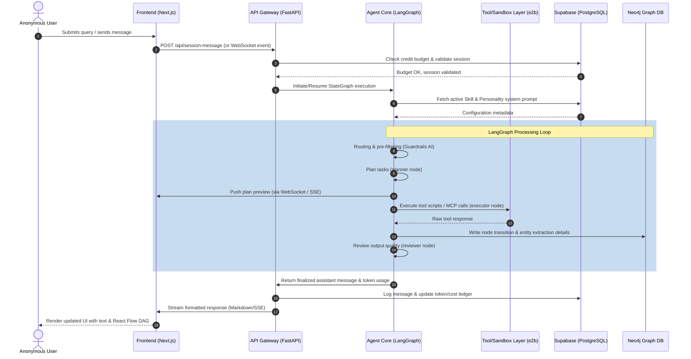

# FORGE — System Architecture & Design
<!-- Architecture version: 1.0.0 | Author: claude-code + KSR | Date: 2026-06-12 -->

This document describes the end-to-end architecture, data flows, database schemas, and component structure of the Forge Multi-Session Agent Platform.

## System Topology & Layers

```
┌─────────────────────────────────────────────────────────────┐
│                        FRONTEND LAYER                       │
│         Next.js 14 + Tailwind + shadcn/ui + Zustand         │
├─────────────────────────────────────────────────────────────┤
│                       API GATEWAY                           │
│              FastAPI + Cloudflare Tunnel + CORS             │
├──────────────┬──────────────────────────┬───────────────────┤
│  AGENT CORE  │    TOOL & SKILL LAYER    │  CONTROL PLANE    │
│  LangGraph   │  MCP + Custom Tools +    │  Guardrails +     │
│  + DSPy +    │  Sandboxed Exec +        │  Policy Engine +  │
│  LiteLLM     │  Webhooks + WebSockets   │  Human-in-Loop    │
├──────────────┴──────────────────────────┴───────────────────┤
│                     ASYNC TASK LAYER                        │
│               Celery + Redis + Temporal                     │
├─────────────────────────────────────────────────────────────┤
│                    PERSISTENCE LAYER                        │
│        Supabase (PostgreSQL + pgvector) + Neo4j/Memgraph    │
├─────────────────────────────────────────────────────────────┤
│                  OBSERVABILITY LAYER                        │
│          OpenTelemetry + Opik + PostHog + GrowthBook        │
├─────────────────────────────────────────────────────────────┤
│                     INFRA LAYER                             │
│          Docker + Terraform + Cloudflare + Railway          │
└─────────────────────────────────────────────────────────────┘
```

---

## Data Flow: Lifecycle of a Query

The diagram below details how a query progresses through the system:



---

## Core Technology Selection & Rationale

| Layer | Technology Selected | Rationale | Alternatives Considered |
|-------|---------------------|-----------|-------------------------|
| **Agent Core** | **LangGraph** | Enables stateful, cyclic graphs which are essential for multi-step agent planning and execution loops. | AutoGen, LangChain agents |
| **Prompt Engineering** | **DSPy** | Treats prompts as code. Optimizes prompts dynamically and reduces regression when underlying LLMs are changed. | Raw string formatting |
| **LLM Inference** | **LiteLLM** | Provider-agnostic API interface. Enables users to bring their own keys (BYOK) for 100+ providers. | Native SDKs (OpenAI, Anthropic) |
| **Primary Relational DB** | **Supabase (Postgres)** | Built-in authentication, instant APIs, Postgres stability, and `pgvector` for scalable RAG storage. | Self-hosted PostgreSQL |
| **Graph Memory** | **Neo4j AuraDB** | Native Cypher support, built-in graph visualizations, and standard Option B conversation graph schema. | Memgraph, AWS Neptune |
| **Background Tasks** | **Celery + Upstash Redis** | Lightweight, proven celery daemon for executing custom python scripts and third-party tools asynchronously. | Temporal (reserved for Phase 4) |
| **Isolation / Sandboxing** | **e2b sandbox** | Isolated micro-virtual machines with rapid start times, providing safe execution of user-submitted python scripts. | Local Docker subprocesses |

---

## LangGraph Node Structure

Every conversation executes on a stateful `LangGraph` topology consisting of the following six nodes:

```
                  ┌─────────────────┐
                  │  input_router   │
                  └────────┬────────┘
                           │
                  ┌────────▼────────┐
                  │   pre_filter    │
                  └────────┬────────┘
                           │
                  ┌────────▼────────┐
                  │     planner     │◄────────┐
                  └────────┬────────┘         │
                           │                  │ (Loop for each subtask)
                  ┌────────▼────────┐         │
                  │    executor     │─────────┘
                  └────────┬────────┘
                           │
                  ┌────────▼────────┐
                  │    reviewer     │
                  └────────┬────────┘
                           │
                  ┌────────▼────────┐
                  │output_formatter │
                  └─────────────────┘
```

1. **`input_router`**: Evaluates complexity of user prompt and maps it to either single-step response or multi-step plan.
2. **`pre_filter`**: Applies Guardrails AI policies and checks for prompt injections or malicious tool request inputs.
3. **`planner`**: Decomposes multi-step tasks into a topological checklist and checks token cost limits.
4. **`executor`**: Dispatches execution requests to sandboxed scripts, MCP servers, or web APIs.
5. **`reviewer`**: Critiques execution outputs against planning objectives to detect contradictions or failures.
6. **`output_formatter`**: Transforms raw JSON structured outputs into polished streaming Markdown with source references.

---

## Database Schemas

### Relational Database Schema (Supabase)

Our relational architecture contains the following core tables:

```
┌─────────────────┐       ┌─────────────────┐       ┌─────────────────┐
│    sessions     │◄──────┤    messages     │      ┌┤    api_keys     │
├─────────────────┤       ├─────────────────┤      │├─────────────────┤
│ id (PK, UUID)   │       │ id (PK, UUID)   │      ││ id (PK, UUID)   │
│ created_at      │       │ session_id (FK) │      ││ provider_name   │
│ model_alias     │       │ sender (role)   │      ││ encrypted_key   │
│ credit_budget   │       │ content (text)  │      │└─────────────────┘
│ status          │       │ token_usage     │      │
│ inactive_ttl    │       │ cost_usd        │      │┌─────────────────┐
└─────────────────┘       └─────────────────┘      └┤  credit_ledger  │
                                                    ├─────────────────┤
┌─────────────────┐       ┌─────────────────┐       │ id (PK, UUID)   │
│     skills      │◄──────┤   personalities │       │ session_id (FK) │
├─────────────────┤       ├─────────────────┤       │ amount_usd      │
│ id (PK)         │       │ id (PK)         │       │ direction (I/O) │
│ name (unique)   │       │ name (unique)   │       └─────────────────┘
│ prompt_fragment │       │ system_prompt   │
│ tools_list      │       │ temp_override   │
└─────────────────┘       └─────────────────┘
```

- **`sessions`**: Tracks session state, inactive timeout limit (default 2h), model config, and budget enforcement indicators.
- **`messages`**: Raw logs of conversation messages between the user, tools, and the assistant.
- **`api_keys`**: Encrypted API keys written to Supabase Vault, mapped to providers.
- **`skills`**: Available capabilities configured by the administrator that can be injected into execution state.
- **`personalities`**: Model overrides and baseline system instructions.
- **`credit_ledger`**: Logs of token usage costs calculated per token from LiteLLM.

### Graph Database Schema (Neo4j)

Used to manage semantic connections and conversation step mapping (Option B Graph):

- **Nodes**:
  - `(s:Session {id: String, created_at: String})`
  - `(m:Message {id: String, sender: String, content: String})`
  - `(e:Entity {name: String, type: String, description: String})`
  - `(d:Decision {id: String, node_type: String, prompt_version: String})`
  - `(t:ToolCall {id: String, tool_name: String, input: String, status: String})`
- **Edges**:
  - `(s)-[:CONTAINS]->(m)`
  - `(m)-[:MENTIONS]->(e)`
  - `(e)-[:RELATED_TO {type: String}]->(e)`
  - `(d)-[:TRANSITIONED_TO]->(d)`
  - `(d)-[:INVOKED]->(t)`
  - `(t)-[:RESOLVED_TO]->(m)`

---

## Module Dependency Map

The backend runtime relies on strict linear import restrictions:

```
[api Gateway] ──(routes)──> [services] ──(graph/db/tools)──> [app/db] & [app/graph]
    │                          │
    ▼                          ▼
[app/models] <────────────── [app/core] (LangGraph modules)
```

- `backend/app/api/`: Must **only** handle incoming requests, query parsing, and returning HTTP responses. Zero business logic.
- `backend/app/services/`: Binds business processes together (e.g. creating a session, processing a refund check, compiling tools).
- `backend/app/core/`: Contains LangGraph agent loop orchestration and DSPy prompts. Does not make database modifications directly.
- `backend/app/db/`: All Supabase interface calls and PostgreSQL connections.
- `backend/app/graph/`: Neo4j interface and graph queries.
